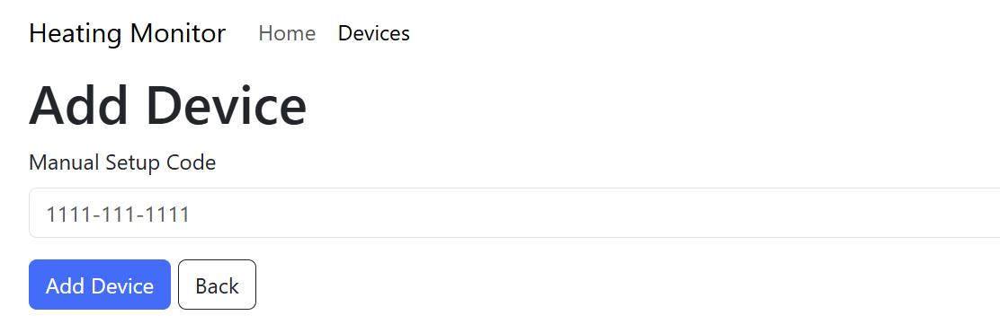
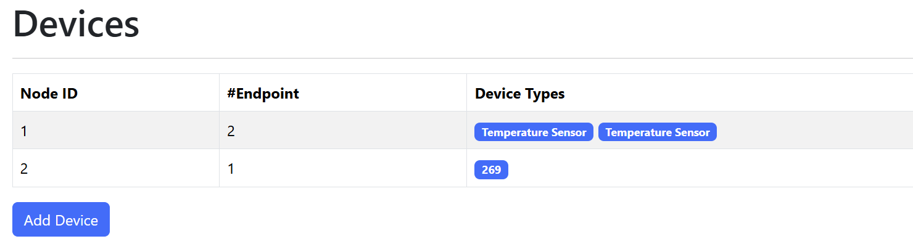

# Matter Heating Monitor

## Building

Start by ensuing the `html_app` is compiled. This will generate several files and place them in the `html_data` directory.

```
cp html_app
npm run build -- --emptyOutDir
```

Next, you will need to set the Thread Network Dataset. This can be found in the `nodes_post_handler` function. 

```
char *dataset = "0e080000000000000000000300001935060004001fffc0..."
```

Finally, compile the firmware

```
idf.py build
```

## Running

Flash the firmware onto an the S3 OTBR board, opening the monitor too

```
idf.py flash monitor
```

With the ESP32 console openEnter the command into the console to connect the board to WiFi

```
matter esp wifi connect {SSID} {Password}
```

## Commissioning

Once connected, find the IP address in hte logs.

Open this from your browser and navigate to the Device tab. Click the `Add Device` button.



Enter the setup code from your device and click `Add Device`.

I don't have any callbacks or anything to tell you when this completes, so keep an eye in the logs.

When it's done, the device will appear under the Device tab.


