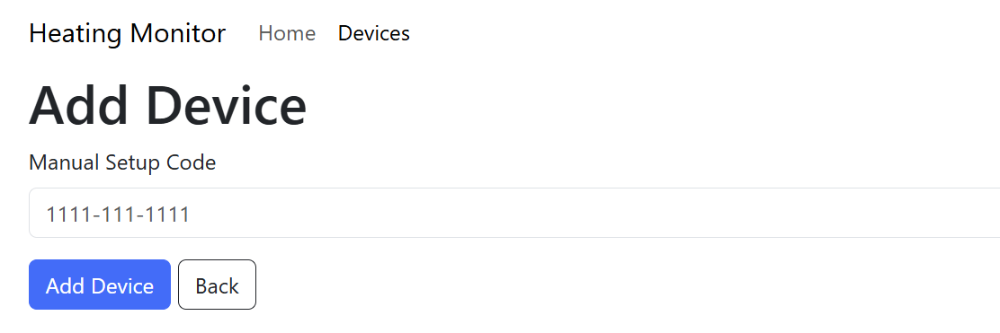
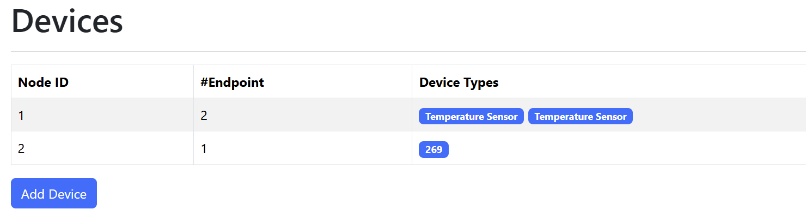

# Matter Heating Monitor

The Heating Monitor is a Matter based designed to aggregate all information about your home heating system. At present, it supports monitoring room temperatures and radiator temperatures.

## Hardware

This firmware targets the **Waveshare ESP32-S3-ETH** board (16MB flash, octal PSRAM), which
carries a W5500 SPI Ethernet controller. Networking is Ethernet only — plug in a cable and the
board comes up on DHCP. BLE is still used to commission the Thread temperature sensors.

W5500 wiring (see `ESP32_custom/NetworkCommissioningDriver_Ethernet.cpp`):

| Signal | GPIO |
|---|---|
| SPI host | SPI2_HOST |
| SCLK | 13 |
| MOSI | 11 |
| MISO | 12 |
| CS | 14 |
| INT | 10 |
| RST | 9 |

## Building

This project uses `esp-idf` and `esp-matter`, so ensure both of these frameworks are installed. 

>[!NOTE]
>I had to make changes to the `esp-matter` SDK to better support subscriptions - these are pendings as a PR https://github.com/espressif/esp-matter/pull/1690

### CHIP external platform

The ESP32-S3 has no internal Ethernet MAC, but connectedhomeip's `ESPEthernetDriver::Init()` is
hard-coded for it, so it does not compile for this target (see
[esp-matter#1785](https://github.com/espressif/esp-matter/issues/1785)). This repo therefore ships
its own copy of the CHIP ESP32 platform layer in `ESP32_custom/`, with a W5500
implementation of `Init()` and an added `chip_enable_ethernet` block in `BUILD.gn`.

Nothing extra needs to be done to use it — the root `CMakeLists.txt` copies the tree to
`$ESP_MATTER_PATH/../platform/ESP32_custom` (the location esp-matter's own CI uses, and what
`CONFIG_CHIP_EXTERNAL_PLATFORM_DIR` resolves to) at CMake configure time.

To refresh the copy against a newer esp-matter, re-run:

```
cp -r "$ESP_MATTER_PATH/connectedhomeip/connectedhomeip/src/platform/ESP32/." ESP32_custom
cp "$ESP_MATTER_PATH/examples/common/external_platform/BUILD.gn" ESP32_custom/BUILD.gn
```

then re-apply the two local changes (the `chip_enable_ethernet` block in `BUILD.gn`, the W5500
`Init()`) and rewrite `platform/ESP32/` includes to `platform/ESP32_custom/` across the copy —
without that rewrite the copied sources pull in the original headers alongside the custom ones and
fail with redefinition errors.

You will need to set the Thread Network Dataset in code. This can be found in the `nodes_post_handler` function. 

```
char *dataset = "0e080000000000000000000300001935060004001fffc0..."
```

Then compile the firmware

```
idf.py build
```

This also builds the React app (`npm run build` in `html_app/`) and embeds it in the firmware
binary — there is no separate web-app build step, and an OTA update carries the UI with it.

## Running

Flash the firmware onto the ESP32-S3-ETH board, opening the monitor too

```
idf.py flash monitor
```

With an Ethernet cable plugged in, the board picks up an address over DHCP on boot — there is no
console step. Watch for `Ethernet Connected` followed by the DHCP address in the log.

## Commissioning

Open `http://heating-monitor.local` from your browser (the address is also in the logs) and
navigate to the Device tab. Click the `Add Device` button.



Enter the setup code from your device and click `Add Device`.

I don't have any callbacks or anything to tell you when this completes, so keep an eye in the logs.

When it's done, the device will appear under the Device tab.



# TODO

* [ ] Improve subscriptions
* [ ] Real-Time UI updates
* [ ] Saving data onto SD card
* [ ] Sending data via MQTT
* [ ] Ability to configure Thread Dataset via UI
* [ ] Indicate subscription status in the UI
* [x] mDNS support for easier access

# Thanks

I want to thank the author of the ESP_MATTER_CONTROLLER project as it gave me a lot of guidance, pointers and clues! https://github.com/Live-Control-Project/ESP_MATTER_CONTROLLER
I'm also using this project to help parse some of the URIs https://github.com/sidoh/path_variable_handlers
